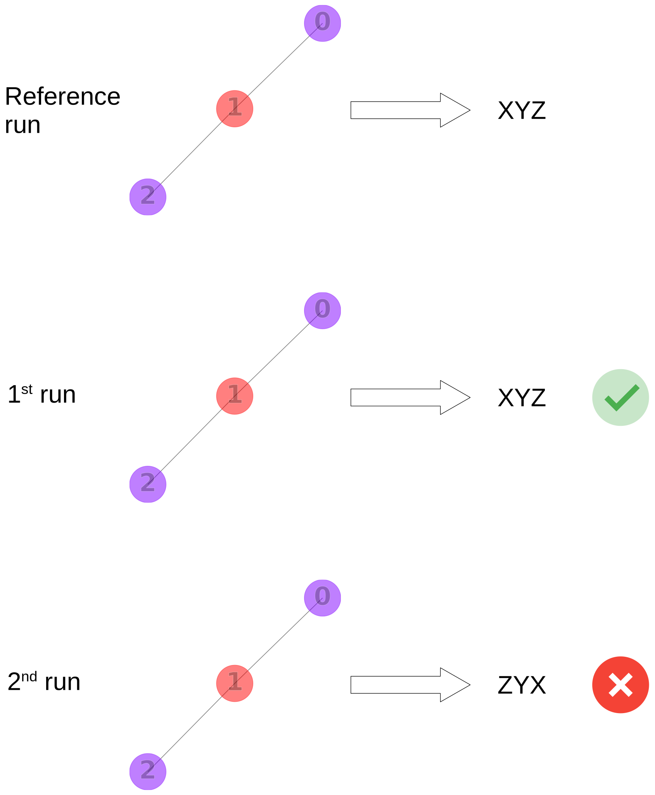

# Regression tests




## Compute reference

```Shell
./tests/compute_regression_reference.sh
```
downloads `libinchi.so.1.06.00`, the shared library belonging to the current stable InChI release,  
and generates a `<dataset>_regression_reference.sqlite` file for each dataset under `data`.  
The `sqlite` file contains a table with the InChI strings for each structure.

For example,

| consumer | time | molfile_id | result |
| --- | --- | --- | --- |
| regression | 2023-05-31T09:36:50 | 9261759198 | InChI=1S/C2BF6/c4-2(5,6)1-3(7,8)9/q-1 |
| regression | 2023-05-31T09:36:50 | 2139556156 | InChI=1S/AsCl3/c2-1(3)4 |


## Run tests

```Shell
./tests/run_regression_tests.sh
```
compiles the shared library `libinchi.so.dev` from the current state of the repository.
It then uses this library to compute the InChI strings for each structure in each dataset under `data`.
Those strings are compared with the corresponding reference.
For each dataset under `data`, the comparisons are logged to `<dataset>_regression.sqlite`,  
either as `passed` or the `difference between the current and reference strings`.

For example,

| consumer | time | molfile_id | result |
| --- | --- | --- | --- |
| regression | 2023-05-31T09:36:50 | 9261759198 | passed |
| regression | 2023-05-31T09:36:50 | 2139556156 | 'Foo=1S/AsCl3/c2-1(3)4' != 'InChI=1S/AsCl3/c2-1(3)4'- Foo=1S/AsCl3/c2-1(3)4? ^^^+ InChI=1S/AsCl3/c2-1(3)4? ^^^^^ |

To convince yourself that the tests fail once a regression has been introduced, 
change `INCHI_NAME` in `INCHI-1-SRC/INCHI_BASE/src/mode.h`  
and re-run the tests (remove `<dataset>_regression.sqlite` before, it won't be overwritten by default).
The tests should now fail and indicate that the difference between the reference results and the latest test run is the change you've made.

